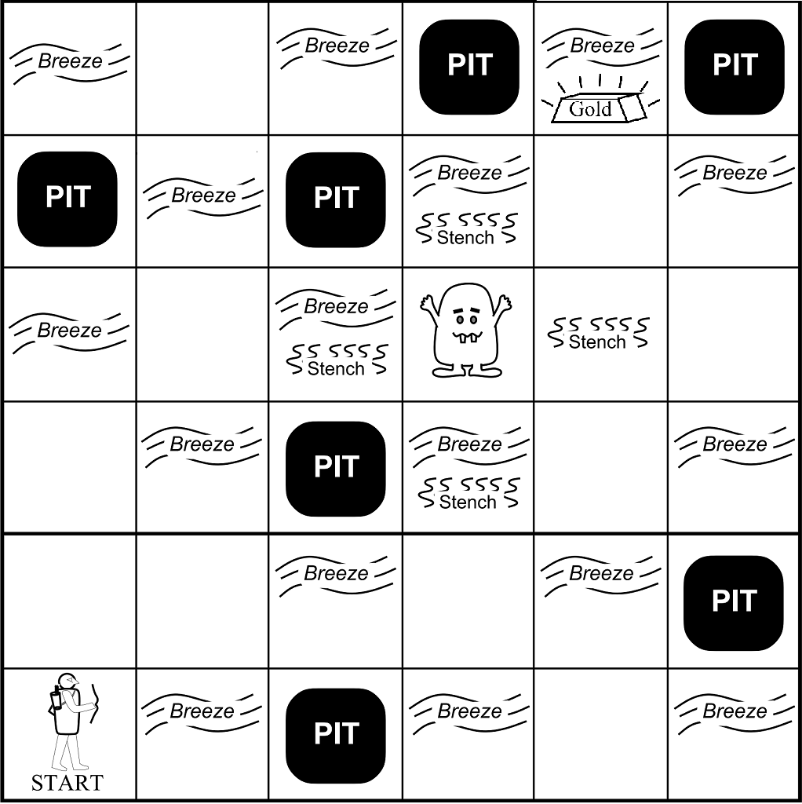

# 🧠 Deep Q-Networks: From Scratch to Solving Complex RL Environments

[](https://python.org)
[](https://pytorch.org)
[](https://gymnasium.farama.org/)
[](LICENSE)

A complete implementation of Deep Q-Network (DQN)and Double DQN algorithms using PyTorch from scratch - applied to a custom Wumpus World grid-world, CartPole-v1, and MountainCar-v0. This project demonstrates deep reinforcement learning fundamentals including experience replay, target networks, and techniques to reduce overestimation bias.

<p align="center">
  
</p>

---

## 📋 Table of Contents

- [Highlights](#-highlights)
- [Project Structure](#-project-structure)
- [Environments](#-environments)
- [Part I — Neural Network Architectures for RL](#part-i--neural-network-architectures-for-rl)
- [Part II — Deep Q-Network (DQN)](#part-ii--deep-q-network-dqn)
- [Part III — Double DQN](#part-iii--double-dqn)
- [Results](#-results)
- [Setup & Installation](#-setup--installation)
- [Usage](#-usage)
- [Tech Stack](#-tech-stack)
- [References](#-references)

---

## ✨ Highlights

- **Built entirely from scratch** - no RL libraries (Stable-Baselines, RLlib, etc.); only PyTorch for neural networks
- **Custom Gymnasium environment** - a 6×6 Wumpus World with multiple observation/action space configurations
- **12 neural network configurations** explored across 4 observation types × 3 action types
- **DQN + Double DQN** implemented, trained, and compared across 3 distinct environments
- **All agents solve** their respective environments (CartPole > 470, MountainCar > −110)
- **Pre-trained model weights** included for reproducibility

---

## 📁 Project Structure

```
deep-q-networks-wumpus-world/
│
├── 📓 Part_1_Neural_Network_Setup.ipynb          # NN architectures for various RL spaces
├── 📓 Part_2_DQN_Implementation.ipynb            # Vanilla DQN — training & evaluation
├── 📓 Part_3_Double_DQN_Comparison.ipynb         # Double DQN + comparative analysis
│
├──  environment.py                                # Custom Wumpus World (Gymnasium API)
├── 📄 requirements.txt                           # Python dependencies
│
├── 📁 trained_model_files/                     
│   ├── part_2_dqn_gridworld.pth
│   ├── part_2_dqn_cartpole.pth
│   ├── part_2_dqn_mountaincar.pth
│   ├── part_3_ddqn_gridworld.pth
│   ├── part_3_ddqn_cartpole.pth
│   └── part_3_ddqn_mountaincar.pth
│
├── 📁 images/                                     # Environment rendering sprites & diagrams
│   ├── wumpus_world_environment.jpg
│   ├── agent.png, wumpus.png, gold.png, pit.png, ...
│   └── 📁 neural_network_structures/              # Architecture visualizations
│
└── 📄 README.md
```

---

## 🌍 Environments

### 1. 🏰 Wumpus World — Custom Grid-World

A **custom 6×6 grid environment** built from scratch using the Gymnasium API:

| Feature | Details |
|---------|---------|
| **Grid Size** | 6 × 6 (36 states) |
| **Hazards** | 7 pits (instant death) + 1 Wumpus monster |
| **Perceptual Clues** | Breeze (adjacent to pits), Stench (adjacent to Wumpus) |
| **Goal** | Navigate to collect gold while avoiding all hazards |
| **Observation Types** | Integer · Vector · Image (84×84 grayscale) · Float |
| **Action Types** | Discrete (4-dir) · Continuous · Multi-Discrete |

### 2. 🏗️ CartPole-v1

Balance a pole on a moving cart — a classic continuous-state control benchmark.

| Feature | Details |
|---------|---------|
| **State** | 4D continuous (position, velocity, angle, angular velocity) |
| **Actions** | Discrete — push left or right |
| **Solve Criterion** | Average reward **> 470** over evaluation episodes |

### 3. ⛰️ MountainCar-v0

Drive an underpowered car up a steep hill by building momentum through oscillation.

| Feature | Details |
|---------|---------|
| **State** | 2D continuous (position, velocity) |
| **Actions** | Discrete — push left, no-op, push right |
| **Solve Criterion** | Average reward **> −110** over evaluation episodes |

---

## Part I — Neural Network Architectures for RL

Designed and implemented neural networks for all **12 combinations** of observation types × action types supported by the Wumpus World environment:

| Observation ↓ \ Action → | Discrete | Continuous | Multi-Discrete |
|---------------------------|----------|------------|----------------|
| **Integer** (1D) | Dense: 1→64→**4** | Dense: 1→64→**1** | Dense: 1→64→**4** (sigmoid) |
| **Vector** (2D) | Dense: 2→64→**4** | Dense: 2→64→**1** | Dense: 2→64→**4** (sigmoid) |
| **Image** (84×84) | CNN→128→64→**4** | CNN→128→64→**1** | CNN→128→64→**4** (sigmoid) |
| **Float** (1D) | Dense: 1→64→**4** | Dense: 1→64→**1** | Dense: 1→64→**4** (sigmoid) |

> Architecture diagrams are available in `images/neural_network_structures/`.

---

## Part II — Deep Q-Network (DQN)

Full implementation following the **DeepMind Nature paper** (*Mnih et al., 2015*):

### Algorithm Overview

```
Initialize replay buffer D, Q-network θ, target network θ⁻ ← θ
For each episode:
    For each step:
        Select action a = ε-greedy(Q(s; θ))
        Execute a, observe r, s'
        Store (s, a, r, s', done) in D
        Sample random minibatch from D
        Compute target: y = r + γ · max_a' Q(s', a'; θ⁻)
        Update θ by minimizing (y − Q(s, a; θ))²
    Periodically: θ⁻ ← θ
```

### Key Components

| Component | Purpose |
|-----------|---------|
| **Replay Buffer** | Breaks temporal correlation by storing and sampling past transitions uniformly |
| **Target Network** | Provides stable Q-value targets; synced periodically with the online network |
| **ε-Greedy Exploration** | Decays ε from 1.0 → ε_min to balance exploration and exploitation |
| **Huber / MSE Loss** | Smooth loss function for robust gradient updates |

### Training Visualizations (per environment)

Each notebook generates:
- 📈 **Reward curve** - total reward per episode during training
- 📉 **Loss curve** - training loss per episode
- 📊 **Epsilon decay** - exploration rate over time
- 🎯 **Evaluation results** - greedy policy performance (10+ episodes)

---

## Part III — Double DQN

Implemented **Double DQN** (*van Hasselt et al., 2016*) to address the **overestimation bias** inherent in vanilla DQN.

### The Problem with Vanilla DQN

Standard DQN uses the `max` operator for both **selecting** and **evaluating** actions, which systematically overestimates Q-values — especially in noisy or stochastic environments.

### The Double DQN Fix

```
Vanilla DQN:    y = r + γ · max_a' Q_target(s', a')
                         ↑ same network selects AND evaluates

Double DQN:     y = r + γ · Q_target(s', argmax_a' Q_online(s', a'))
                                          ↑ online selects    ↑ target evaluates
```

By **decoupling action selection** (online network) from **action evaluation** (target network), Double DQN produces more accurate value estimates and more stable training.

### Comparative Analysis

Side-by-side DQN vs. Double DQN comparison across all three environments:
- Combined reward-dynamics plots (two curves per environment)
- Loss comparison during training
- Evaluation performance comparison

---

## 📊 Results

| Environment | DQN | Double DQN | Solved? |
|-------------|-----|------------|---------|
| **Wumpus World** (Grid) | ✅ Converged | ✅ Converged | ✅ |
| **CartPole-v1** | Avg > 470 | Avg > 470 | ✅ |
| **MountainCar-v0** | Avg > −110 | Avg > −110 | ✅ |

> Both algorithms successfully solve all environments. Double DQN generally shows more stable training curves and reduced value overestimation. Detailed plots and analysis are in the notebooks.

---

## 🚀 Setup & Installation

### Prerequisites
- Python 3.9+
- CUDA-capable GPU (optional, but recommended)

### Quick Start

```bash
# Clone the repository
git clone https://github.com/Jeetkavaiya/DQN-reinforcement-learning.git
cd deep-q-networks-wumpus-world

# Create virtual environment
python -m venv rlenv
source rlenv/bin/activate        # Linux / macOS
# rlenv\Scripts\activate         # Windows

# Install dependencies
pip install -r requirements.txt
pip install torch jupyter
```

---

## 💻 Usage

### Run the Notebooks

```bash
jupyter notebook
```

Open the notebooks in order:
1. **`Part_1_Neural_Network_Setup.ipynb`** - Explore NN architectures for different RL spaces
2. **`Part_2_DQN_Implementation.ipynb`** - Train & evaluate vanilla DQN on all 3 environments
3. **`Part_3_Double_DQN_Comparison.ipynb`** - Train Double DQN & compare against vanilla DQN

### Load Pre-trained Models

```python
import torch

# Load a trained DQN agent for CartPole-v1
model = DQNNetwork(input_dim=4, output_dim=2)
model.load_state_dict(torch.load('trained_model_files/part_2_dqn.pth'))
model.eval()
```

### Train from Scratch

Each notebook contains complete training loops. Simply run all cells to reproduce results. Hyperparameters are documented inline and can be tuned.

---

## 🛠️ Tech Stack

| Tool | Purpose |
|------|---------|
| **Python 3.9+** | Core language |
| **PyTorch** | Neural network construction & training |
| **Gymnasium 1.2.1** | RL environment interface |
| **NumPy 2.3** | Numerical computing & array operations |
| **Matplotlib 3.10** | Training curves & result visualization |
| **Pillow 11.3** | Image processing for environment rendering |
| **Jupyter Notebook** | Interactive development & documentation |

---

## 📚 References

1. Mnih, V., et al. (2015). *Human-Level Control through Deep Reinforcement Learning*. Nature, 518(7540), 529–533. [[Paper]](https://www.nature.com/articles/nature14236)
2. van Hasselt, H., Guez, A., & Silver, D. (2016). *Deep Reinforcement Learning with Double Q-Learning*. AAAI. [[Paper]](https://arxiv.org/abs/1509.06461)
3. Schaul, T., et al. (2016). *Prioritized Experience Replay*. ICLR. [[Paper]](https://arxiv.org/abs/1511.05952)
4. [Gymnasium Documentation](https://gymnasium.farama.org/)
5. [PyTorch Documentation](https://pytorch.org/docs/)
